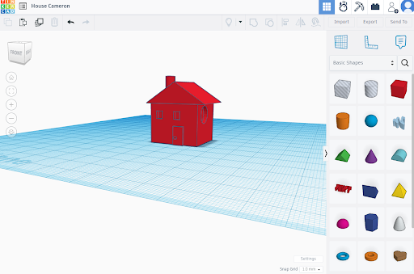
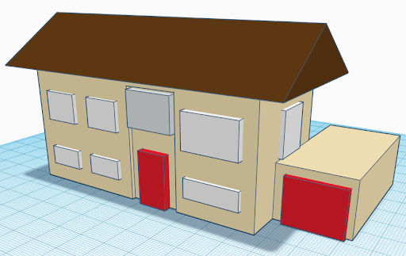

[Slides](https://docs.google.com/presentation/d/1SE1AWqsd_q2Td5k5wWqYX8y7-4xSoFo_/edit?usp=sharing&ouid=112244992976166574655&rtpof=true&sd=true){target="_blank"}

Here is an example of a project-based learning activity with 3D modelling. For example, a special unit on architecture could culminate with students designing and creating a 3D model of a building. Create a simple model of the exterior of a house or building you are familiar with. 
 
1. Add the required shapes, add a cube "**box** and a triangle "**roof**" to your building area
2. Next raise the roof to place it overtop of the box. To do this use the black arrow pointing upwards until it reaches the top of the box. Click on a different spot of the roof and drag it over the box.

<button onclick="toggle('gif1')">Show/Hide Animation</button>
    

        
        

4. We won't worry about the alignment, but for more complex levels you could use the align button here.

5. Next we will add windows and a door, by adding more "boxes" you can adjust the size to window sides by pulling in the ends and duplicate the boxes by selecting the duplicate option. 

     <button onclick="toggle('gif2')">Show/Hide Animation</button>
        

        
        

6. You can either indent it by creating a small hole and clicking the greyed out colour or select the color black as show in the video.
7. You can also make them stick out by making the boxes wider by using the white side corners. 
     

