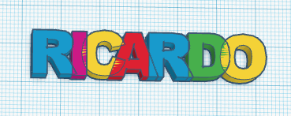
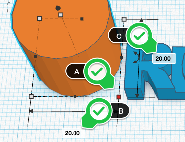
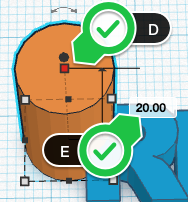

# Keychain Activity 
[Slides](https://docs.google.com/presentation/d/1QLnEOjQqvUIjBa3PCKEJYTn7m-UR6xO2ygM2Vj-cu2w/edit?usp=sharing){:target="_blank"}

If you and your group have any questions or get stuck as you work through this in-class exercise, please ask the instructor for assistance.  Have fun!

1. If you haven’t already, please go to [the TinkerCad website and create an account](http://tinkercad.com){:target="_blank"} for yourself. If you find yourself in a tutorial, click on the Tinkercad logo in the top left of the screen to exit to the home page.
 

2. Click **Create new design**. If the TinkerCad tutorial pane is up on the right-hand side, you will need to get out of it before proceeding. Click on the TinkerCad logo at the top to bring you back to your main page. From there you should see the “Create new design” button. 

3. On the right side of the TinkerCad open a drop-down menu by clicking on **Basic Shapes**, and then select the **Design Starters** option, then the **"A" Letter Icon**. This will display a list of 3D letters that you can scroll down through to find the whole alphabet, plus numbers 1 through 9.  

4. Drag and drop all the individual letters from a name or word you want to use onto the workplane. 

    <button onclick="toggle('gif1')">Show/Hide Animation</button>
    

    
    

5. Select all the letters and then click on the **Align Button**.

6. Then click on the black handle on the bottom left of the text to align the text along the bottom.
    

7. Now move the letter closer together so that they overlap a significant amount so that when your keychain is printed it will stay together when some stress is put on it. See my example below:
    

    <button onclick="toggle('gif2')">Show/Hide Animation</button>
    

    
    

8.  To make the lettering a bit more interesting we are going to raise every other letter by 2mm from the current 4mm.  To start doing this click on the first letter, and then (A) click on the **white dot** near the middle of the letter (which will then turn red). (B) click on the **4.00** and change the number to “6” and then press the enter key, and the first letter will stand higher than all the rest. Raise every second letter so that your name looks something similar to this:
    

    <button onclick="toggle('gif3')">Show/Hide Animation</button>
    

    
    

9.  Now we’ll group all the letters together by selecting them all, and then clicking on the **Group** button. All the letters will change to the same colour and you can now select all the letters as one object.
    

    <button onclick="toggle('gif4')">Show/Hide Animation</button>
    

    
    

10.  The last thing we need to do is to add a loop to your text so you can more easily hang your new design on your key ring. Start by clicking on **Text and Numbers** in the right panel, and then select **Basic Shapes**. This will display basic geometric shapes for us again.  Select the orange cylinder and drag and drop it into the workplane.

    <button onclick="toggle('gif5')">Show/Hide Animation</button>
    

    
    

11. Once the cylinder is in the workspace we need to resize. Start by selecting the cylinder, and then (A) clicking on **white handle** at the bottom right which will turn it red. (B) Now click on the **20.00** and change it to **10**. (C) Click on the other **20.00** and change it to **10** as well.  (D) Next select the **white dot** at the top of the cylinder (it will turn red), and then (E) change the **20.00** to **6** and press enter. 
    

    <button onclick="toggle('gif6')">Show/Hide Animation</button>
    

    
    

12.  Next we need to make a hole in the middle of the cylinder, so we’ll grab a grey striped cylinder and drop it on the workplane.  Now select the bottom right “handle” and change both the width and depth dimensions from **20.00** to **6**.

13. Drag and drop the grey cylinder into the middle of the orange cylinder.  Now select both cylinders and the text and then press the **Group** button on the top toolbar. 

    <button onclick="toggle('gif7')">Show/Hide Animation</button>
    

    
    

14. Lastly, click on the **Export** button on the top right of the toolbar, and then select **.STL** and save the file to your hard drive so it’s ready for the next stage of the 3D printing process.
    

Adapted by Digital Scholarship Commons 3D Design and Print Resource
Copyright © 2021 UVic Libraries Digital Scholarship Commons - dscommons@uvic.ca

[NEXT STEP: Game Piece Activity](5-game-activity.html){: .btn .btn-blue }
