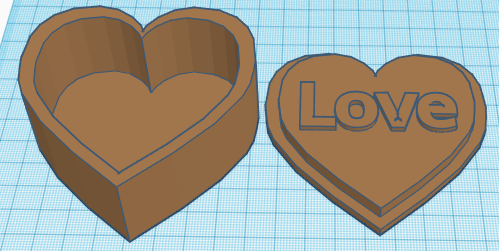

 
# Heart-Shaped Box Activity
1. Open up [TinkerCad](https://www.tinkercad.com/){:target="_blank"}, create an account or log-in. Open a new design. 

2. Make a heart:
- Grab a **Heart** from the **Basic Shapes** panel on the right and drag it onto the workplane.
- Resize the heart so that its length and width are both **80mm** by dragging the white square handles on the base and top of the heart (or by clicking on one of the white square handles and entering “**80**” in the fields). 
- Change the height of the heart to **30mm** by clicking on the handle in the middle of the heart. 

3. Make a second heart:  
- Duplicate the heart by clicking **Duplicate** at the top-left of the screen or by clicking **Ctrl + D**.
- Resize the heart so that its length and width are both **70mm** by dragging the white square handles on the base and top of the heart (or by clicking on one of the white square handles and entering “**70**” in the fields). 
- Raise this heart **2mm** from the workplane by dragging the small black “cone” on the top of the heart upwards.

4. Make a copy for the lid:
- Select both hearts by holding down the Shift key and clicking them. 
- Click on **Duplicate** and drag the new hearts to a clear area on the workplane.
- There should now be four hearts on the workplane.

5. Make the box out of one set of hearts:  
- Make the smaller heart a hole by changing the **Shape** from **Solid** to **Hole** at the top-right of the screen.
- Select both hearts and click **Align** at the top-right of the screen. 
- Click on the two middle black circular handles to bring the hearts into alignment.
- Click **Group** at the top-right of the screen to combine the objects into one. 

6. Make the lid out of the second set of hearts:  
- Change the height of the larger heart to **3mm** by clicking on the white square handle in the middle of the heart.
- Change the height of the smaller heart to **6mm**.
- Resize the smaller heart so that its length and width are both **68mm** by dragging the white square handles on the base and top of the heart (or by clicking on one of the white square handles and entering “**68**” in the fields). This allows the lid to fit easily in the box.
- Select both hearts and click **Align** at the top-right of the screen.
- Click on the two middle black circular handles to bring the hearts into alignment.
- Click **Group** to combine the objects into one.

7. **OPTIONAL**: Place text on the inside of the lid.   
- Grab a **Text** from the **Basic Shapes** panel on the right and drag it onto the workplane.
- Write whatever is to be written on the inside of the box in the **Text** field. 
- Change the Bevel to approximately **1**. This makes the text thicker and therefore easier to 3D print.
- Resize the length and width to be small enough to fit on the inside of the lid.  
- Drag the text into the lid. 
- Select the text and the heart, then click Align  at the top-right of the screen.
- Click on the two middle black circular handles to bring the hearts into alignment.
- Select the text and the lid, then click **Group**. 

8. Export your design as 3D printable files: 
- Select the main box. 
- Click on the “**Export**” button on the top right of the toolbar. Select the option include “the selected shape” and then select “**.STL**” and save the file to your computer.
- **Repeat with the lid**. 

[NEXT STEP: Snowperson Ornament Activity](snowperson-activity.html){: .btn .btn-blue }
